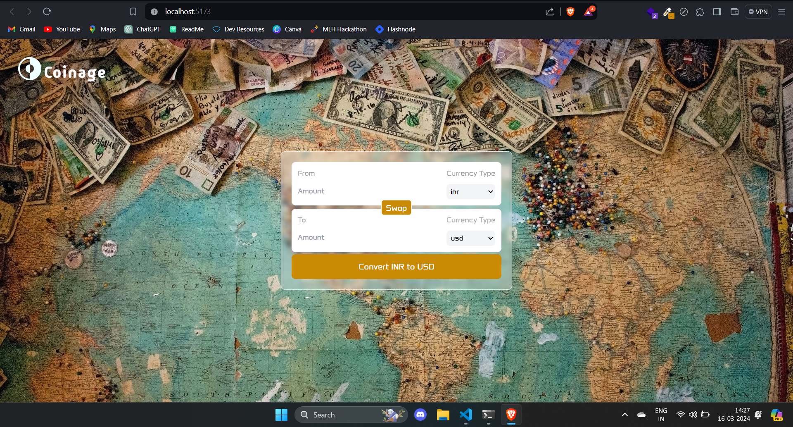

# Introduction

A ultimate resource for currency value conversion (Supports Crypto Currency Conversion Too).
# Installation

To run this project on your local environment, you need to fork and copy the repo to your local environment first

- Then get inside the project folder in your local environment
```bash
  cd Coinage
```

- Install node modeules

```bash
  npm i
```
- Then run the dev server

```bash
  npm run dev
```
# Demo



